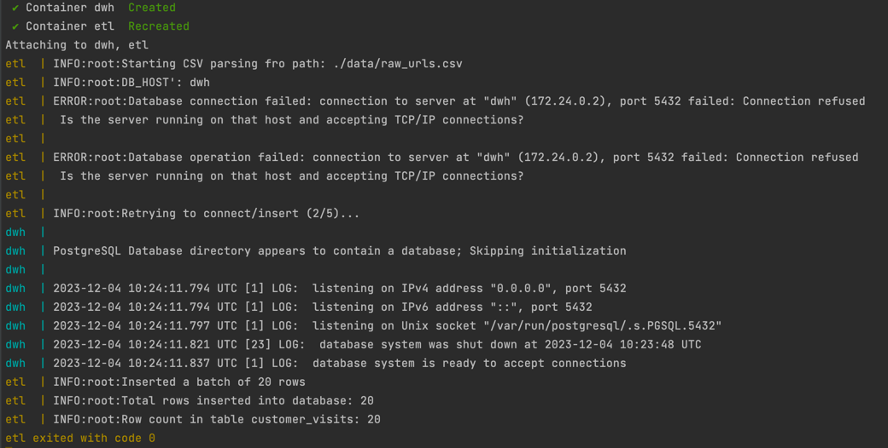

# ETL Flow Script

This script is designed to extract data from CSV files, transform the data, and load it into a PostgreSQL database. It is part of an ETL (Extract, Transform, Load) process focusing on handling URL data.

**_NOTE_**: This process doesn't support delta (incremental) inserting data. Only TRUNCATE --> INSERT. Can be updated in the future version.

## Overview

The ETL script performs the following steps:
1. Reads URLs from a CSV file.
2. Parses each URL and renames certain query parameters based on a predefined mapping.
3. Batches the processed data.
4. Insert batches of data into a PostgreSQL database, handling retries in case of connection issues.

## Prerequisites

- Python 3.8 or later.
- PostgreSQL database.

For local using nned to install the requirements.txt:
```bash
pip install --no-cache-dir -r ./etl/requirements.txt
```

## Project structure:
- `data`: Contents input data.
- `etl`: _tests_ and _etl_flow.py_ script. _Dockerfile_ contents install requirements, run _pytests_ and _etl_flow_.
- `sql`: initial SQL script for Postgres container.
- `docker-compose.yaml`: _dwh_ (deploy Postgres) and _etl_ (run tests and etl flow) services for emulate ETL work flow.
- `.env`: ENV variable for _dwh_ (deploy Postgres) in docker-compose.yaml. This sensitive information better to store in any Secret Manager (like AWS Secret Manager service)


## Environment Variables
The script relies on the following environment variables, which should be defined in a .env file:
```
POSTGRES_DB: The name of your PostgreSQL database.
POSTGRES_USER: Your PostgreSQL user.
POSTGRES_PASSWORD: Your PostgreSQL password.
DB_HOST: Hostname of your PostgreSQL server.
DB_PORT: Port number of your PostgreSQL server.
```

Example .env file:
```
POSTGRES_DB=mydatabase
POSTGRES_USER=user
POSTGRES_PASSWORD=password
DB_HOST=localhost
DB_PORT=5432
```
The sensitive value has to be stored in Secret Manager like (AWS Secret Manager service).

## Logging
Logging is configured to the INFO level, displaying important process information. Modify the logging level in the script if you need more or less verbosity.

## Usage
### Input File:
Place your CSV file containing URLs in the ./data/ directory. The file should be named raw_urls.csv.

## Running the Script
Execute the script with Python:
```
python ./etl/etl_flow.py
```

## Output
The script logs the process of reading, transforming, and loading the data. It will also log the total number of rows inserted into the database.

## Functions
- `parse_and_rename_url(url: str) -> dict`:
Parses the provided URL and renames query parameters based on the specified mapping.
- `create_db_connection() -> psycopg2.connect`:
Creates and returns a connection to the PostgreSQL database.
- `insert_into_db(batch_data: list) -> int`
Inserts a batch of data into the PostgreSQL database and returns the number of rows inserted.
- `process_csv_file(file_path: str) -> None`
Processes the specified CSV file, extracting URLs, transforming the data, and loading it into the database.

## Error Handling
The script includes error handling for database connection issues, retrying the connection multiple times before failing.

# Testing
Execute the test suite with:
```
python -m pytest etl/tests/test_etl_flow.py
```

## Test Descriptions
- `test_parse_and_rename_url`:
Validates the parse_and_rename_url function. It checks if the URL query parameters are correctly parsed and renamed according to a predefined mapping.

_**Test Case 1:**_ URL with all expected query parameters.

_**Test Case 2:**_ URL missing some query parameters.

- `test_successful_connection`:
Tests the `create_db_connection` function for a successful database connection. It mocks the psycopg2.connect method and ensures that the connection object is returned correctly.

- `test_connection_failure`:
Checks the error handling of the `create_db_connection` function when a database connection fails. It mocks a connection failure and verifies if the appropriate exception is raised.

- `test_insert_into_db_success`:
Ensures that the insert_into_db function correctly inserts data into the database. This test mocks the database connection and the execute_values method, and verifies if data insertion operations are called as expected.

- `test_insert_into_db_failure`:
Tests the retry logic in the insert_into_db function during database operation failures. It simulates repeated connection failures and checks if the function correctly retries and eventually raises an error.

- `test_process_csv_file`:
Verifies the process_csv_file function. It mocks file reading and CSV parsing, ensuring that the URL parsing and database insertion functions are called correctly for each row in the CSV file.

## Mocking Strategy
The tests use the `unittest.mock` module to mock external dependencies, including database connections and file I/O operations. This approach isolates the functions and allows for testing without the need for a real database or file system.

# Running

run ETL:
```
docker-compose up --build
```

stop and remove:
```
docker-compose down
```

The result of ETL execution logs:


As you can see we deploy Postgres, handle connection to Postgres, parse CSV input file, and inset data to Postgres with handling of total number inserted rows (and check count() in DB table).
